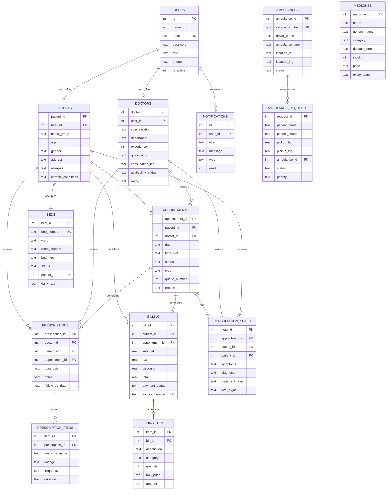

# 🏥 Smart Hospital Management System — ER Diagram

## Entity Relationship Diagram

## Table Summary

| Table | Description | Key Relationships |
|-------|-------------|-------------------|
| **users** | Central auth table for all roles | Parent of patients, doctors |
| **patients** | Patient profiles & medical info | FK to users |
| **doctors** | Doctor profiles & specializations | FK to users |
| **appointments** | Booking and scheduling | FK to patients, doctors |
| **prescriptions** | Medical prescriptions | FK to doctors, patients, appointments |
| **prescription_items** | Individual medicines in a prescription | FK to prescriptions |
| **beds** | Hospital bed tracking | FK to patients (when occupied) |
| **ambulances** | Ambulance fleet management | Referenced by requests |
| **ambulance_requests** | Emergency pickup requests | FK to ambulances |
| **billing** | Invoice and payment tracking | FK to patients, appointments |
| **billing_items** | Line items on a bill | FK to billing |
| **medicines** | Pharmacy inventory | Standalone |
| **notifications** | User alerts and messages | FK to users |
| **consultation_notes** | Detailed visit notes | FK to appointments, doctors, patients |
